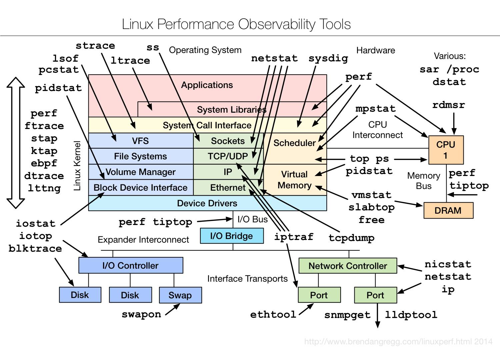

**Congratulations!**

You hit this page cause you want to be ready for high profile Golang job interview or need to structure your interview questions.  

Golang is a great language for building modern web-applications based on micro-services architecture. Easy to start. Extremely convenient from DevOps perspective.  
https://golang.org/
https://gobyexample.com/

If it's so easy to start how is it possible for great companies to distinguish average developer from great one? What kind of knowledge make difference if you are building services for the top internet companies like Facebook, Twitter, Google?

You should see what surrounds Golang eco-system. 

Here's some areas where most Senior Developers lack of basics despite many years of experience:
   - Networking (Protocols, API related HTTP Headers, Web-Socket) 
   - Bitwise Operators, http://www.tutorialspoint.com/go/go_bitwise_operators.htm
   - Regexp
   - Memory Allocation, https://golang.org/doc/effective_go.html
   - Algorithmic thinking (Logic, Big O notation()
   - Linux (File IO, commands, performace, ...)

#### Networking 
We are all spending most of our time around APIs built by someone else.
Wouldn't be great to understand underline networking protocols HTTP/2, WebSockets, WebRTC, etc?

Ilya Grigorik, Google wrote a great book, High Performance Browser Networking: 
https://s3-ap-southeast-1.amazonaws.com/mylekha-ebook/IT+%26+Programming/Network/High-Performance-Browser-Networking-Ilya-Grigorik.pdf

Secure it! XSS, CSRF, CORS, JWT, etc
http://jwt.io 

#### Regexp
Easy! Learn how to visualize it

^\({0,1}((0|\+61)(2|4|3|7|8)){0,1}\){0,1}(\ |-){0,1}[0-9]{2}(\ |-){0,1}[0-9]{2}(\ |-){0,1}[0-9]{1}(\ |-){0,1}[0-9]{3}$

https://goo.gl/
http://regexr.com/
https://regex101.com/

#### Algorithmic thinking and experience
* Algorithm Visualizer, http://jasonpark.me/AlgorithmVisualizer/#path=graph_search/dfs/tree
* Algorithms and Data Structures for Golang, https://github.com/0xAX/go-algorithms
* Algorithms and Data Structures in Python , https://www.youtube.com/playlist?list=PLsJ_X8XMWFjOfvMXk7HsZYr8vUwYVxTQM

#### Linux 
Look at this! It was built by large community over the past 20 years and has a lot of great, well-optimized libraries. There is no need to reinvent everything in Golang.  

#### Interview check-lists and recommended reading 
* An introduction to distributed systems, https://github.com/aphyr/distsys-class
* Most Golang related interview shadows "50 Shades of Go" article.
Can you explain in plain English how Concurrency and Parallelism work in Go?`
http://devs.cloudimmunity.com/gotchas-and-common-mistakes-in-go-golang/
* Do you know how to write High Performance Go?
http://go-talks.appspot.com/github.com/davecheney/presentations/writing-high-performance-go.slide#1
* How to Pass a Programming Interview (triplebyte.com)
https://news.ycombinator.com/item?id=11246917

#### Codility and other online testing 
* Most HR expects you to score 200+ from 300 points. Practice, https://codility.com/programmers/lessons/  
* Tips for tasks on Codility, http://dev.tasubo.com/2012/09/tips-for-tasks-on-codility.html

DON'T SKIP TRAINING! You are compiting again other candidates. Good news - most candidates are too lazy, overconfident and 90% of them won't bother to spend 4-6 hours to practice.

WHAT NEXT?

#### American Accent
* If you are not native speaker, invest in American Accent
https://www.youtube.com/watch?v=wIoD11Q8WQk&list=PLB132BCC7B2FD1FB9

#### Community 
Golang's main power is in its community. Here's the list of great people you might want to follow
* Brad Fitzpatrick https://twitter.com/bradfitz
* Dave Cheney https://twitter.com/davecheney
* Russ Cox https://twitter.com/_rsc
* Peter Bourgon https://twitter.com/peterbourgon
* Mitchell Hashimoto https://twitter.com/mitchellh
* Damian Gryski https://twitter.com/dgryski
* Andrew Gerrand https://twitter.com/enneff
* Dmitry Vyukov https://twitter.com/dvyukov
* Brian Ketelsen https://twitter.com/bketelsen
* JBD https://twitter.com/rakyll
* Francesc Campoy https://twitter.com/francesc

Your feedback is greatly appreciated! Send me email on 1@ilya1.com